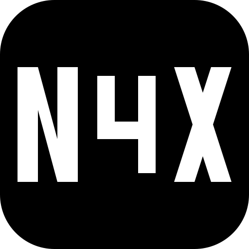
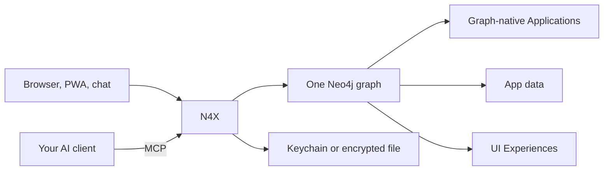

<div align="center">



# N4X – Your Cloud for Small Software

**Agents made small software applications easy to write.**
**N4X is what makes them easy to operate.**

Your AI / MCP client builds your apps directly in the N4X cloud. They are live from that moment — a browser app, a PWA, or a chat-native MCP application.

At its core N4X uses a graph database as a shared layer for your apps’ source code and data — so-called graph-apps. That is the representation AI understands best, and how you get cross-app functionality without heavy integration. The N4X runtime serves your graph-apps, and the MCP server you use to build and edit them. A big part of N4X itself is such a graph-app, so you can adapt the way it works.

Point Cursor, Claude, Codex, or any MCP client at your N4X cloud. Describe the app. And start using it.

[](./LICENSE)

</div>

## Quick start

### Local

You need [Docker](https://docs.docker.com/get-docker/). The first start builds the image and can take several minutes.

```bash
git clone https://github.com/P451M/n4x-core.git && cd n4x-core && sh scripts/local.sh
```

That starts N4X and Neo4j on your computer only. Docs: [https://n4x.emergingthoughts.org/docs](https://n4x.emergingthoughts.org/docs).

- MCP: [http://127.0.0.1:7744/mcp](http://127.0.0.1:7744/mcp)
- Health: [http://127.0.0.1:7744/health](http://127.0.0.1:7744/health)

Stop with `sh scripts/local.sh down`. For a public machine, see [Self-host](#self-host).

### Managed

Creating an account at [https://n4x.emergingthoughts.org/](https://n4x.emergingthoughts.org/) puts you on the waitlist. A machine exists only after we accept the request. Then point a client at `https://<your-origin>/mcp`.

### Connect your AI client

HTTP, not stdio. On a managed cloud, use `https://<your-origin>/mcp` instead of `127.0.0.1`.

Cursor and Claude Desktop:

```json
{
  "mcpServers": {
    "n4x": {
      "type": "http",
      "url": "http://127.0.0.1:7744/mcp"
    }
  }
}
```

Paste that into `~/.cursor/mcp.json`, or into Claude Desktop’s config (`~/Library/Application Support/Claude/claude_desktop_config.json` on macOS).

```bash
# Claude Code
claude mcp add --transport http n4x http://127.0.0.1:7744/mcp

# Codex
codex mcp add n4x --url http://127.0.0.1:7744/mcp
```

Cloud ChatGPT cannot reach `127.0.0.1`. Use a client from this list, or a [managed](#managed) origin and point the client at `https://<your-origin>/mcp`.

Ask the client to call `inspect_client_guide`. Then describe a small notes app, or ask it to import and activate `examples/notes.n4xp` from this clone. That file is an ordinary `.n4xp` package: the client stages, inspects, and imports it. When an Experience is live, open `http://127.0.0.1:7744/experience/{id}` — the client returns the id.

## Why N4X

- **Zero deployments.** The app is not a repo you ship later. Your AI client writes it in N4X. From that commit on the graph, it is running — browser, PWA, or chat.
- **One shared world.** Application source and application data live in the same graph. The AI reads and edits that graph as context. Cross-app functions are graph relationships: a mail app can file a note, a calendar can read a project.
- **Graph-apps, including N4X.** Source, schema, and records are graph objects. A big part of N4X itself is a graph-app, so you can adapt how it works. There is no separate app metadata store and no sidecar database for domain data.

Move apps between instances as a `.n4xp` package. IMAP, CalDAV, and API keys live in macOS Keychain, or an encrypted file on Linux. The graph stores a reference, never the value.

Anyone who can reach MCP can change the instance, including dump, import, and reset. This is a personal runtime, not a multi-tenant SaaS and not a sandbox for untrusted code. Host control HTTP (`/n4x-host/*`) is localhost-only; that is not a security boundary once `/mcp` is reachable. Keep a local try-out on your computer. A public origin needs identity you add in front; N4X does not ship that.

`scripts/local.sh` and `deploy/compose.yaml` publish only `127.0.0.1:7744`. The image listens on `0.0.0.0` inside the container. `docker run -p 7744:7744` publishes an unauthenticated personal runtime. Do not do that on a public address.

## What you can build

This repository is the engine. Apps are graph objects on the instance you run.

- **A personal context layer** — people, projects, documents, and decisions other apps and AI clients query on the same graph.
- **Automations across apps** — triggers on graph changes, a model or provider call, a write back, or an invoke into another app.
- **Notes** — notebooks, tags, a browser UI.
- **Mail** — IMAP and SMTP in the app, passwords in Keychain.
- **A calendar** — CalDAV, events on the graph, a week view.
- **Whatever you keep wishing existed** — tickets, inventory, a reading list.


## Self-host

You host one N4X environment. Every app you create runs there. There is no per-app deploy.

`deploy/compose.yaml` is N4X and Neo4j on loopback. There is no shipped Caddy, OIDC, or identity proxy. Whoever can reach MCP can change the instance.

On your computer, `scripts/local.sh` is enough. On a public address you must put identity in front of the browser, MCP, and `/callback/*` yourself. We do not ship or support that. Managed N4X already does.

On Linux, keep `N4X_SECRETS_MASTER_KEY` in the environment, not next to the encrypted password file.

## Run from source

If you already have Python 3.13+, [uv](https://docs.astral.sh/uv/), and Neo4j:

```bash
uv sync --extra dev
export N4X_NEO4J_URI=bolt://localhost:7687
export N4X_NEO4J_USER=neo4j
export N4X_NEO4J_PASSWORD=<local-password>
export N4X_NEO4J_DATABASE=neo4j
uv run n4x serve --neo4j --mode production
```

`n4x serve` defaults to `--host 127.0.0.1` and `--mode development` (MCP Inspector). Use `--mode production` for a local instance without Inspector.

## Run tests

```bash
uv sync --extra dev
uv run pytest -q
```

Without a configured Neo4j, Neo4j-marked tests skip (about 25). That is expected.

## How it works





Your MCP client writes **Graph-native Applications** onto the graph: source, data model, and records. **UI Experiences** are how you open them. N4X serves browser, PWA, and chat from that one environment. Passwords never enter the graph.


## License

Licensed under the [Apache License 2.0](./LICENSE).